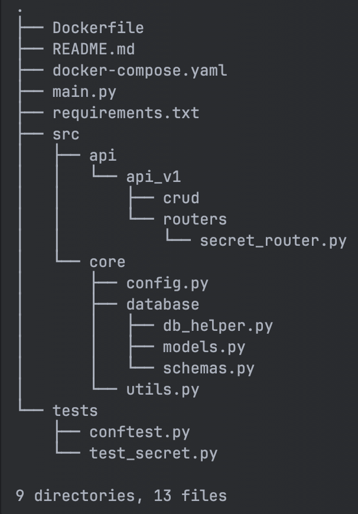

# Приложение "SecretMaker"

API сервис для одноразовых секретов. Он позволяет создать секрет, задать кодовую фразу для его открытия и 
генерирует код, по которому можно прочитать секрет только один раз.

## Структура проекта:

## В проекте были использованы такие библиотеки:

1. Python 3.7
2. FastApi
3. PostgreSQL
4. SqlAlchemy(async)
5. Pytest
6. Docker

## Установка

1. Клонируйте репозиторий на вашу локальную машину:  
   git clone https://github.com/AndrewTarev/secret_maker.git

2. Запустите docker-compose командой:  
   docker compose build  
   docker compose up